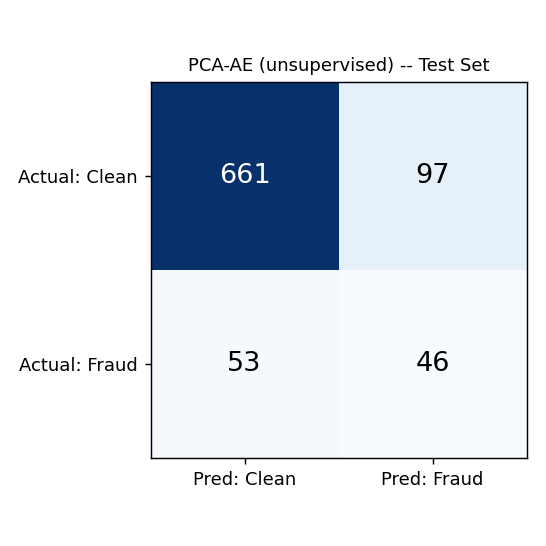
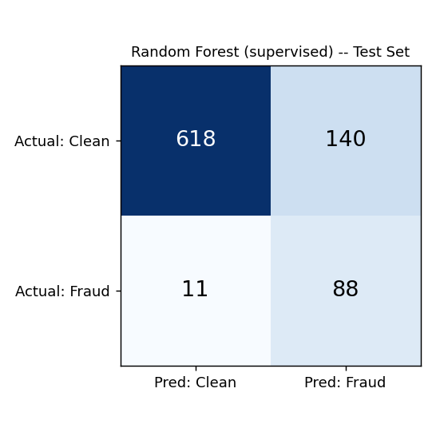
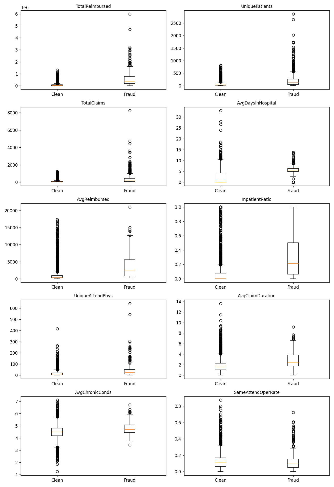

# Clinical Decision Making and Pattern Recognition in Health Care — Cotiviti Intern Assessment

**Topic:** Clinical Decision Making and Pattern Recognition in Health Care
**Focus areas demonstrated:** Time-Series Anomaly Detection, Classification, Clustering, Chain Reasoning, and Agentic Generative AI, applied to Treatment, Payment, and Operations (TPO) — specifically, provider payment integrity.

A working proof of concept that flags anomalous Medicare providers using two complementary models (an unsupervised time-series anomaly detector and a supervised classifier), groups providers into peer clusters, and hands flagged cases to a tool-calling AI agent that reasons step by step before issuing a verdict.

---

## Deliverables in this repo

| Deliverable | File |
|---|---|
| Written report | `Cotiviti_Report.docx` |
| Slide deck | `Cotiviti_Presentation.pptx` |
| Demo video (≤ 5 min) | `Cotiviti_Demo.mp4` |
| Proof of concept (code) | `src/`, this repo |

All deliverables are uploaded directly to this repository as files — no external links (Google Drive, YouTube, etc.), per submission requirements.

---
## Demo
[🎥 Watch Demo](./Deliverables_and_Resume/Video/Demo_Video.mp4)

---
## Repository structure

```
.
├── src/                  # All source code
│   ├── app.py             # Streamlit app — loads pipeline results, runs the live agent demo
│   ├── pipeline.py        # Main entry point: trains both models, saves all results
│   ├── data_prep.py       # Loads and joins the raw Kaggle CSVs
│   ├── anomaly_model.py   # PCA-Autoencoder (unsupervised time-series anomaly detection)
│   ├── classifier.py      # Random Forest (supervised classification)
│   ├── clustering.py      # KMeans peer-group clustering
│   ├── agent.py           # Tool-calling agent (chain reasoning + agentic AI)
│   └── eda.py              # Feature exploration — ranks candidate features by effect size
├── data/                  # Raw Kaggle CSVs (Train/Test, in/outpatient, beneficiary)
├── clean_data/             # Engineered features from eda.py (provider_features_full.csv)
├── models/                 # Saved model artifacts from pipeline.py (.joblib, config.json, peer_benchmarks.json)
├── result/                 # Scored test-set output from pipeline.py (providers + claims CSVs)
├── image/                  # Plots: EDA boxplots, confusion matrices
├── __pycache__/            # Python bytecode cache (gitignored)
├── requirements.txt
└── README.md
```

---

## Setup

1. **Clone the repo and enter it:**
   ```
   git clone <your-repo-url>
   cd <repo-folder>
   ```

2. **Create and activate a virtual environment:**
   ```
   python3 -m venv venv
   source venv/bin/activate        # Mac/Linux
   venv\Scripts\activate           # Windows
   ```

3. **Install dependencies:**
   ```
   pip install -r requirements.txt
   ```

4. **Set your Anthropic API key** (required for the agent step in `app.py`):
   ```
   export ANTHROPIC_API_KEY=your_key_here      # Mac/Linux
   set ANTHROPIC_API_KEY=your_key_here          # Windows cmd
   ```
   Set this in the same terminal window you'll run the app from — it doesn't carry over between terminal sessions

---

## How to run

### 1. (Optional) Explore the data
```
python3 src/eda.py
```
Computes 10 candidate features for every eligible provider and ranks them by Cohen's d effect size against the real fraud label. Outputs `provider_features_full.csv` and `eda_boxplots.png`.

### 2. Run the pipeline (required)
```
python3 src/pipeline.py
```
This is the core step. It:
- Splits providers into train (60%) / validation (20%) / test (20%), stratified by fraud label
- Fits the PCA-Autoencoder on **clean-only** training claims (standard practice for reconstruction-error anomaly detection)
- Fits a Random Forest classifier on the EDA-validated provider features
- Fits KMeans clustering for peer grouping
- Tunes thresholds on validation (optimizing F2, with a precision floor so results stay operationally usable)
- Reports final precision / recall / F1 / F2 / AUC-ROC / AUC-PR and a confusion matrix for **both models**, on the held-out test set — data neither model ever saw during fitting or tuning
- Saves everything the app needs

### 3. Run the app
```
streamlit run src/app.py
```
Opens in your browser. Shows both models' results side by side, the provider ranking table, and a live "Run agent investigation" button — the agent gets only precomputed statistics (never raw claims data), decides on its own whether to call a peer-benchmark lookup tool, reasons through 5 explicit steps, and renders a verdict.

---

## Results (held-out test set)

Both models trained on the same split, scored only on the 20% of providers neither model touched during fitting or threshold tuning.

### PCA-Autoencoder (unsupervised) — Time-Series Anomaly Detection


| Metric | Value |
|---|---|
| Precision | 32.2% |
| Recall | 46.5% |
| F1 | 38.0% |
| F2 | 42.7% |
| AUC-ROC | 0.721 |
| AUC-PR | 0.289 |

### Random Forest (supervised) — Classification


| Metric | Value |
|---|---|
| Precision | 38.6% |
| Recall | 88.9% |
| F1 | 53.8% |
| F2 | 70.5% |
| AUC-ROC | 0.930 |
| AUC-PR | 0.670 |

**Why both models:** the unsupervised PCA-AE never learns from the fraud label directly — it only learns what claims from known-clean providers look like, then flags deviations. That makes it better suited to catching **novel** fraud patterns with no historical precedent. The Random Forest trains directly on the label, so it scores higher on these metrics, but can only recognize fraud that resembles what it was shown. Keeping both gives more complete coverage than either alone.

### Feature selection (EDA)


Ten literature-standard provider-level features were ranked by Cohen's d effect size against the real fraud label before being used in clustering and classification (`clean_data/provider_features_full.csv`). `TotalReimbursed` (d = 2.16), `UniquePatients` (d = 1.27), and `TotalClaims` (d = 1.20) showed the strongest separation; `SameAttendOperRate` (d = −0.068) showed effectively none and was dropped.

---

## Techniques demonstrated

| Focus area | Implementation |
|---|---|
| **Time-Series Anomaly Detection** | PCA-Autoencoder on per-claim sequences (claim amount, days since last claim, claim duration), trained on known-clean claims only |
| **Classification** | Random Forest trained directly on the fraud label, using EDA-validated provider features |
| **Clustering** | KMeans on billing volume, patient count, claim count, inpatient ratio, physician count, chronic condition burden |
| **Chain Reasoning** | Agent responds with 5 explicit reasoning steps (signal → volume check → peer context → alternative explanation → conclusion) before a verdict |
| **Agentic Generative AI** | Real tool-calling — the agent decides for itself whether to call `lookup_peer_benchmark` before answering, not a scripted call |

---

## Source

Dataset: [Healthcare Provider Fraud Detection Analysis](https://www.kaggle.com/datasets/rohitrox/healthcare-provider-fraud-detection-analysis) (Kaggle), real CMS Medicare claims data.
